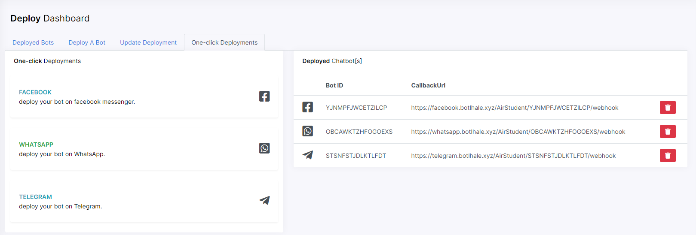

:::caution

Please ensure that you have selected a chat bot **bot** on the top-right _markdown_ `section of your screen`.
:::

## Deployments
 
This section is for chatbot deployment. It allows you to deploy your trained bot to your application. Once you have trained and tested your chatbot, you can now deploy it to an app such as Telegram, WhatsApp or Your Website.  To deploy, go to the `Deploy A Bot` tab and select the language[s] and the model[s] (chatbot) you want to deploy. After specifying all the deployment parameters you can click on the Deploy button. You will be notified via email once the deployment has been successful.

## Deployed Bots

To view and test deployed bots, you need to be on the `Deployed Bots` tab. On this tab you can see deployed bots along with their `BotID` and `Date Deployed`. This tab also provides a `API Docs: Quick Start` where you can see example requests to our API to interact with your deployed bot.

On the `Try it out!` tab your can send requests to test you deployed bot. 

## Update Deployment

To update or delete a live chatbot, navigate to the `Update Deployment` tab and select the models of your choice for the respective languages as demonstarted below.

## One-Click Deployments

Navigate to the `One-click Deployments` tab to get your chatbot to be live on the platform of your choice (`Facebook`, `WhatsApp`, `Telegram`).

:::note
To succssfully launch your chatbot on the platforms listed above, you will be prompted for an authentatication token or key. This information will be available to you upon getting you onboard.
:::

